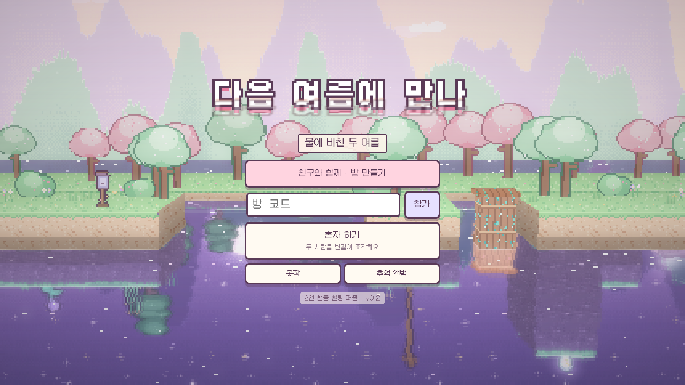
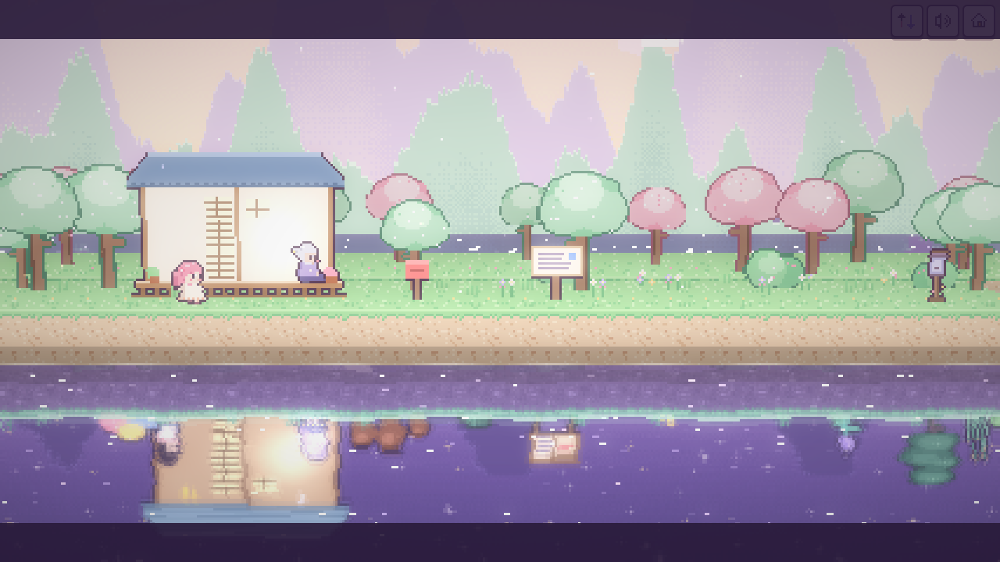
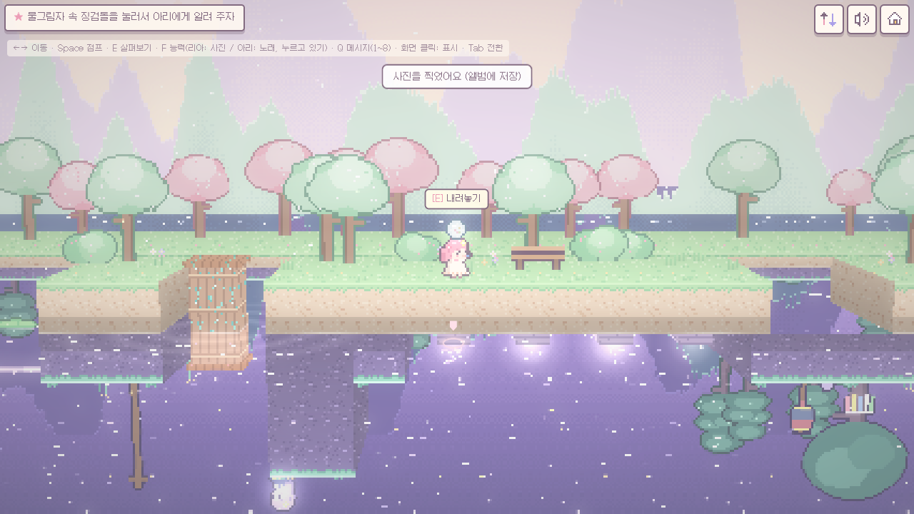
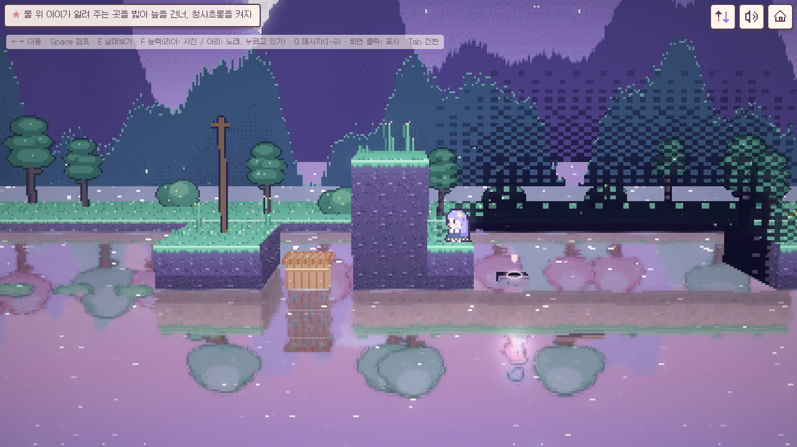
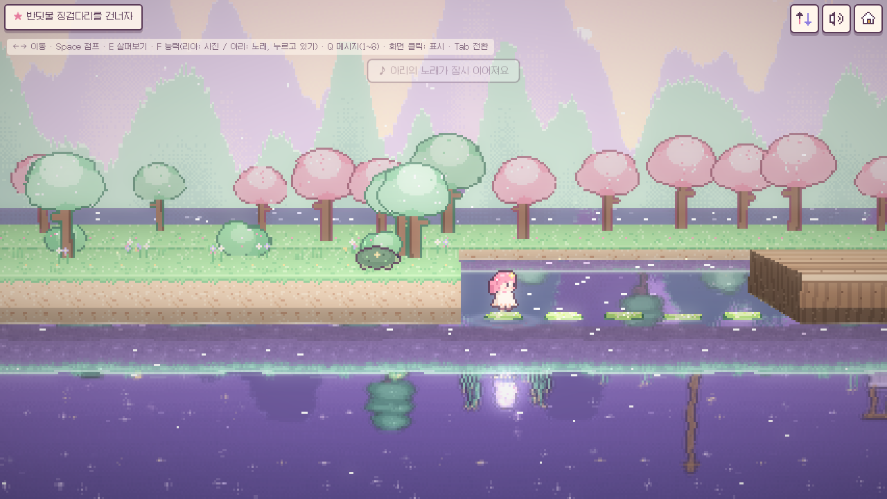
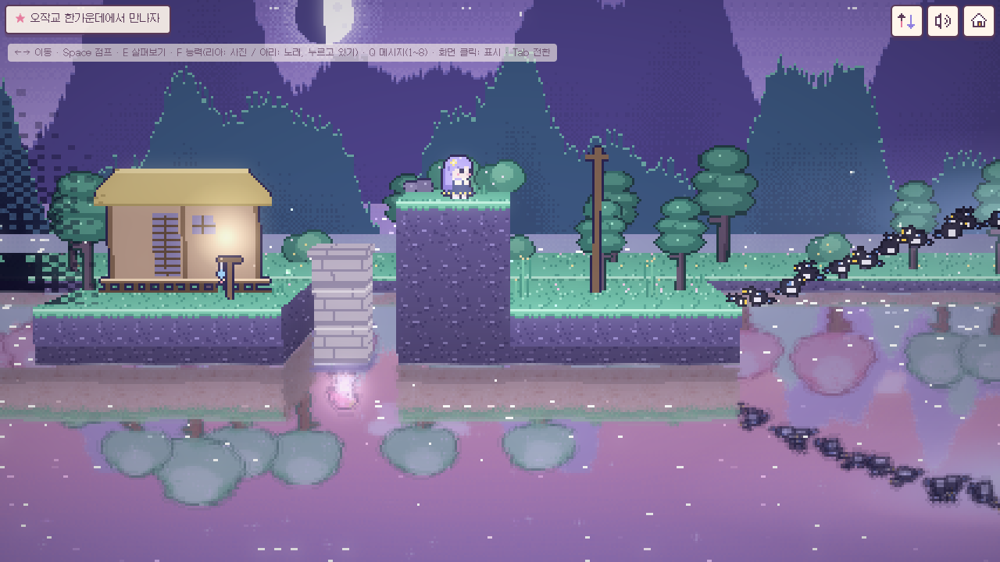

# 다음 여름에 만나 (프로토타입 v0.2)

물에 비친 두 여름. 호수를 사이에 둔 두 소녀의 **2인 전용 협동 힐링 퍼즐 어드벤처**예요.
three.js로 만든 2.5D 도트 게임이고, PWA로 설치할 수 있어요. 별도 게임 서버 없이 WebRTC P2P로 둘이 연결돼요.

**▶ 바로 플레이: [starterpack-master.github.io/yunseul](https://starterpack-master.github.io/yunseul/)**
휴대폰으로 열어서 **친구와 함께 · 방 만들기**를 누르고, 나오는 초대 링크를 친구에게 보내면 돼요. 브라우저 메뉴의 "홈 화면에 추가"를 누르면 앱처럼 설치돼요.

- 기획서 (스토리 반전 포함): [docs/GDD.md](docs/GDD.md)
- 이번 범위: 프롤로그 → 1장 물속의 아이 → 2장 감나무 아래 → 3장 칠석 → 에필로그, 그리고 두 번째 여름(2회차)

| 로비 | 프롤로그 · 할머니 댁 |
|---|---|
|  |  |
| **어둠 속 징검돌 (리아 시점)**: 사진 플래시와 핑으로 물속 길을 알려 줘요 | **어둠 속 징검돌 (아리 시점)**: 리아가 표시한 곳을 밟아요 |
|  |  |
| **반딧불 징검다리**: 아리가 노래하는 동안만 떠 있어요 | **오작교**: 까치 여섯 마리를 모아 다리를 놓아요 |
|  |  |

## 이야기

여름방학, **리아**는 은하호 옆 할머니 댁에 와요. 해 질 녘 호수에 비친 자기 모습이 따로 움직여요. 물 아래의 소녀 **아리**도 똑같은 걸 봐요. 아리가 사는 곳은 칠석이 지나면 댐 때문에 물에 잠길 **달못 마을**이에요.
마을 전설: *"칠석을 앞둔 이레 동안 달못에 윤슬이 뜨면, 물에 비친 사람이 다른 여름을 걷는다."*

| 장 | 왜 가요? |
|---|---|
| 프롤로그 | 리아는 할머니께 별 머리핀을 받아요. 아리는 이삿짐 싸는 밤에 전설을 들어요. |
| 1장 물속의 아이 | 물속 아이를 제대로 보고 싶어서, 전설 속 달맞이 다리로 가요. |
| 2장 감나무 아래 | 할머니가 "감나무 밑에 뭘 묻었는데…" 하세요. 아리는 마을이 잠기기 전에 보물 상자를 남기고 싶어요. |
| 3장 칠석 | 할머니가 리아를 못 알아보셨어요. 아리는 내일 새벽 떠나요. 마지막으로 만나서 물어볼 게 있어요. |

<details><summary>스포일러: 반전과 제목의 뜻</summary>

- 물 아래 세계는 1973년이고, 아리(한아리)는 어린 시절의 할머니예요. 할머니는 손녀에게 아리를 거꾸로 한 이름 **리아**를 지어 줬어요.
- 복선: 똑같은 별 머리핀, 할머니의 자장가 = 아리의 노래, 안내판의 1973년, 50년 된 뿌연 구슬, 거꾸로인 이름, 별 무늬 거북이.
- 제목은 3장에서 아리가 한 약속이에요. 엔딩을 보면 로비 제목의 물그림자가 할머니 쪽에서 본 같은 약속으로 바뀌어요.
</details>

## 플레이 방법

| 모드 | 방법 |
|---|---|
| 친구와 함께 | **방 만들기** → 캐릭터 선택 → 초대 링크를 보내요. 친구가 링크를 열고 **초대받은 방으로 들어가기**를 누르면 연결돼요. 컷신은 각자 자기 캐릭터 이야기로 나오고, 장이 끝나면 두 사람이 다 읽을 때까지 기다려요. |
| 혼자 하기 | 두 캐릭터를 번갈아 조작해요 (Tab 또는 오른쪽 위 전환 버튼). 아리가 노래하다 전환해도 노래가 10초 이어져요. |
| 같은 기기 2탭 테스트 | 주소 끝에 `?net=local`을 붙이고, 한 탭에서 방을 만들고 다른 탭에서 참가해요. |

| 동작 | 키보드 | 터치 |
|---|---|---|
| 이동 | ← → / A D | 왼쪽 조이스틱 |
| 점프 | Space / W / ↑ | 큰 화살표 버튼 |
| 살펴보기·줍기·켜기·대화 | E / Enter | 동작 버튼 (할 수 있는 동작이 표시돼요) |
| 능력: 리아 **사진** / 아리 **노래** | F (아리는 누르고 있기) | 가까이 할 게 없을 때 동작 버튼 |
| 퀵 메시지 8종 | Q, 또는 숫자 1~8 | 말풍선 버튼 |
| 핑 (여기 봐!) | 화면 클릭 | 화면 탭 |
| 시점 전환 (혼자 하기) | Tab | 오른쪽 위 전환 버튼 |

- **리아의 사진**: 플래시가 물 아래까지 닿아서 잠깐 물속이 선명해지고, 어둠에 숨은 징검돌이 드러나요. 찍은 사진은 **추억 앨범**에 남아요.
- **아리의 노래**: 달맞이꽃을 깨우고, 반딧불 징검다리를 띄우고, 까치를 불러요.
- **퀵 메시지**: 안녕! · 고마워 · 좋아 · 잘했어! · 기다려 · 이리 와 · 올라서 줘 · 어떡하지?
- **핑**: 누른 자리에 빛 표시가 생기고 상대 화면에도 보여요. 물그림자(상대 세계)를 누르면 상대 세계에 표시돼요.
- 물에 빠져도 "퐁" 하고 물가로 돌아와요. 시간 제한이나 게임오버는 없어요.

## 두 번째 여름 · 수집 · 꾸미기

- **두 번째 여름 (2회차)**: 엔딩 뒤 새로 시작하면 할머니 대사에 속마음이 붙고, 호숫가에 **할머니의 일기장** 5쪽이 나타나요. 다 모으면 진엔딩이 열려요. 역할을 바꿔서 하면 상대 쪽 이야기를 볼 수 있어요.
- **추억 앨범**: 장마다 숨은 추억 3개와 리아의 사진, 일기장이 모여요.
- **옷장**: 옷 5벌, 머리색 4가지, 소품 4가지. 장을 깨거나 추억을 모으면 열려요. 입은 모습이 친구 화면에도 보여요.
- 진행, 추억, 옷장은 기기(localStorage)에 저장돼요. 계정은 없어요.

<details><summary>스포일러: 숨은 요소</summary>

- 20초 가만히 있으면 꾸벅꾸벅 졸아요.
- 한 장에서 물에 10번 빠지면 붕어가 인사해요.
- 방 코드 칸에 `ARIRIA`를 넣으면 고양이 귀가 열려요.
- 1973년 하늘의 달을 세 번 누르면 달토끼가 보여요.
- 로비 제목을 다섯 번 누르면 물그림자가 잠깐 흔들려요.
- 1973년 라디오와 할머니 집 라디오에서는 같은 노래가 나와요.
</details>

## 연결이 끊겼을 때

잠깐 오프라인이 됐다가 돌아와도 자동으로 다시 이어져요. v0.1에서는 "다시 연결하는 중…"에서 멈췄어요.

- 원인은 세 가지였어요.
  - 릴레이 재시도가 60초를 넘으면 P2P 라이브러리(trystero)가 그 릴레이를 영영 포기하고, 죽은 연결을 계속 재사용했어요.
  - 이전 네트워크에서 만든 WebRTC 제안(offer)은 돌아와도 연결에 실패했어요.
  - 이전 상대가 남아 있으면 새로 들어온 상대를 무시했어요.
- 이렇게 고쳤어요 ([`src/net/transport.ts`](src/net/transport.ts)).
  - 1초 하트비트로 4초 안에 끊김을 알아채요.
  - 네트워크 복귀, 화면 복귀, 참가 오류, 6초 이상 끊김일 때 방에 다시 참가해요. 이때 릴레이 소켓과 WebRTC 연결을 새로 열어요.
- 25초 넘게 안 이어지면 **새로고침해서 다시 연결** 버튼이 나와요. 누르면 같은 방으로 자동으로 다시 들어가요. 호스트가 새로고침해도 브라우저에 저장된 진행 상태로 이어가요.

## 실행

```bash
npm install
npm run dev       # 개발 서버
npm run build     # 타입 검사 + 배포용 빌드 (dist/)
npm run preview   # 빌드 결과 미리보기
npm run deploy    # 빌드해서 GitHub Pages(gh-pages 브랜치)에 올리기
npm run icons     # 앱 아이콘 다시 만들기 (public/icons)
```

## 배포

[GitHub Pages](https://starterpack-master.github.io/yunseul/)로 서비스해요. Pages는 `gh-pages` 브랜치(빌드 결과물)를 그대로 보여 줘요.

- `main`에 커밋이 들어오면 [`.github/workflows/deploy.yml`](.github/workflows/deploy.yml)이 빌드해서 `gh-pages`에 올려요. 1~2분 뒤 사이트에 반영돼요.
- PR을 열면 같은 워크플로가 빌드만 해서 깨진 곳이 없는지 확인해요.
- 내 컴퓨터에서 바로 배포하려면 `npm run deploy`를 실행해요 ([`scripts/deploy-gh-pages.sh`](scripts/deploy-gh-pages.sh), 워크플로도 같은 스크립트를 써요).
- 다른 정적 호스팅(Netlify, Cloudflare Pages 등)에 올릴 때는 `npm run build`로 만든 `dist/`를 그대로 올리면 돼요. 상대 경로로 빌드해서 하위 경로에서도 동작해요.
- 휴대폰에서 PWA 설치와 WebRTC를 쓰려면 HTTPS가 필요해요. GitHub Pages는 기본으로 HTTPS예요.
- 일부 모바일 네트워크는 직접 연결을 막아요. 이런 경우를 위해 TURN 서버를 넣을 수 있어요.
  - GitHub 배포: 저장소 **Settings → Secrets and variables → Actions → Variables**에 `VITE_TURN_URLS`, `VITE_TURN_USERNAME`, `VITE_TURN_CREDENTIAL`을 추가하면 다음 배포부터 적용돼요.
  - 직접 빌드: `VITE_TURN_URLS=turn:turn.example.com:3478 VITE_TURN_USERNAME=user VITE_TURN_CREDENTIAL=pass npm run build`
  - 이 값들은 게임 코드에 들어가서 누구나 볼 수 있어요. 사용량 제한이 있는 계정을 쓰세요.

## 구조

```
src/
  game/
    chapters/  장 데이터: 지형, 장치(등불·말뚝·다리·까치…), NPC, 추억, 일기장, 목표, 대사 트리거
    world.ts   공유 상태와 호스트 시뮬레이션 (행동 적용, 노래·플래시, 목표, 장 넘기기)
    scenes.ts  프롤로그·장 끝·에필로그 컷신 대본        director.ts  컷신 재생기
    game.ts    전체 흐름 (입력, 네트워크, 컷신, 능력, 핑, 이스터에그)
    physics.ts · player.ts · input.ts · save.ts (진행·옷장·앨범 저장)
  render/  도트 생성(pixelart, sprites, characters, icons), 두 세계 장면(stage),
           수면 합성 파이프라인(renderer, shaders), 파티클
  net/     전송 계층(transport: WebRTC P2P + 재접속 / BroadcastChannel), 방·동기화 프로토콜(session)
  audio/   음원 파일 없이 연주하는 BGM, 자장가, 환경음, 효과음
  ui/      화면 UI (목표, 대화, 메시지, 핑, 카드)
pwa/sw-template.js   서비스 워커 템플릿 (빌드할 때 사전 캐시 목록이 채워져요)
scripts/             앱 아이콘 생성, gh-pages 배포 스크립트
.github/workflows/   main에 합치면 자동 배포, PR은 빌드 확인
docs/                기획서와 스크린샷
```

- **그래픽**: 모든 도트(캐릭터, 지형, 소품, 배경, 아이콘)를 코드로 직접 찍어요. 외부 이미지 파일이 없어요.
- **수면**: 두 세계를 각각 렌더링한 뒤, 광선과 수면(y=0)의 교차를 계산해서 상대 세계를 일렁이고 흐리게 비춰요. 아래 세계 플레이어의 화면은 마지막 단계에서 상하만 뒤집어요. 그래서 두 사람 모두 "내가 위, 네가 물속"으로 보고, 왼쪽/오른쪽은 똑같이 통해요.
- **온라인**: 방 코드로 공용 Nostr 릴레이에서 서로를 찾고, 게임 데이터는 WebRTC로 직접 주고받아요. 방을 만든 쪽(호스트)이 공유 상태를 계산하고, 장 전환도 호스트가 정해요.

## 프로토타입의 한계

- TURN 서버가 기본으로 없어서 일부 네트워크 조합(서로 다른 통신사의 모바일 데이터 등)에서는 연결이 안 될 수 있어요. 공용 릴레이에 의존하므로 정식 서비스에서는 자체 시그널링을 권장해요.
- 실제 휴대폰(iOS Safari, 안드로이드 Chrome)에서는 아직 시험하지 않았어요. 헤드리스 Chrome으로 휴대폰 화면과 터치 조작만 확인했어요.
- 소리는 코드로 합성해요. 자동 테스트에서는 재생 오류만 확인했고, 실제로 들어 보며 다듬지는 않았어요.

## 폰트 라이선스

Galmuri © Lee Minseo, SIL Open Font License 1.1 — [public/fonts/Galmuri-OFL.txt](public/fonts/Galmuri-OFL.txt)
