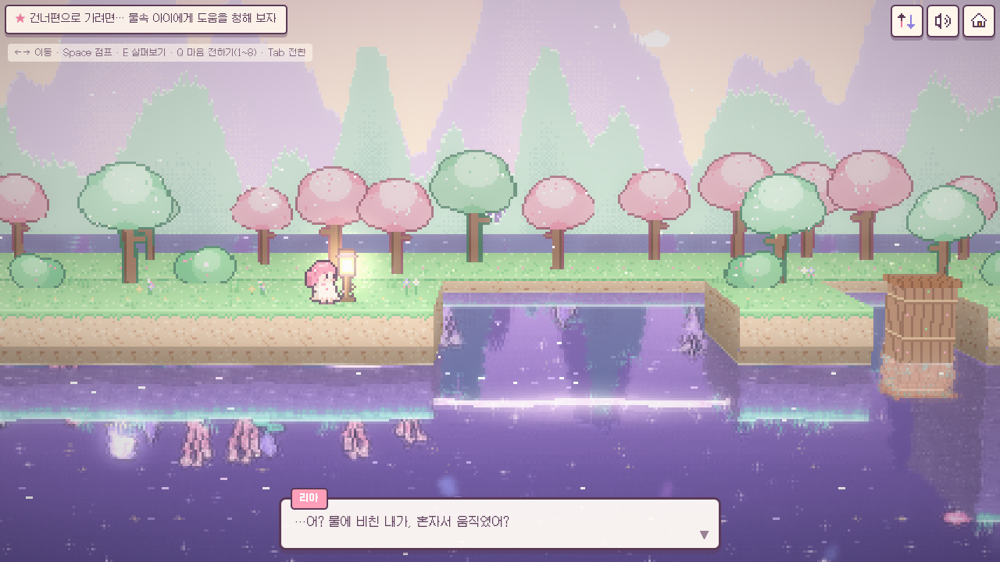
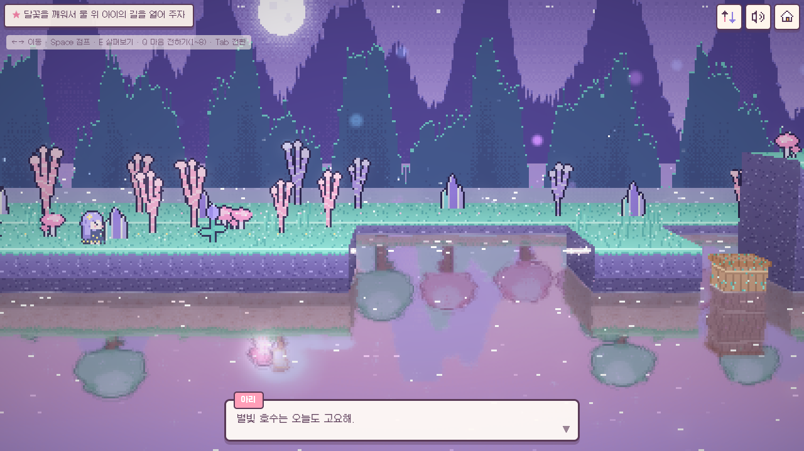
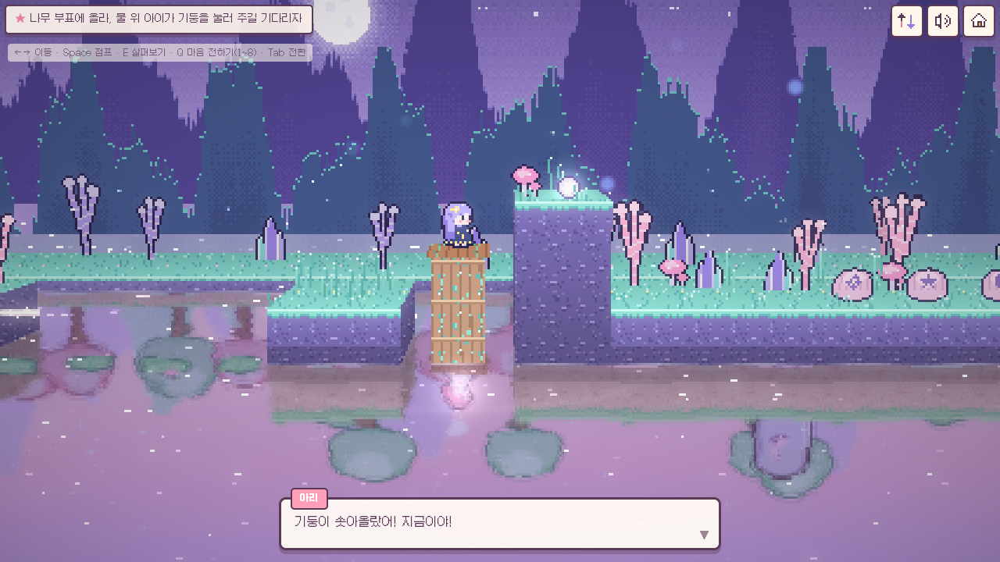
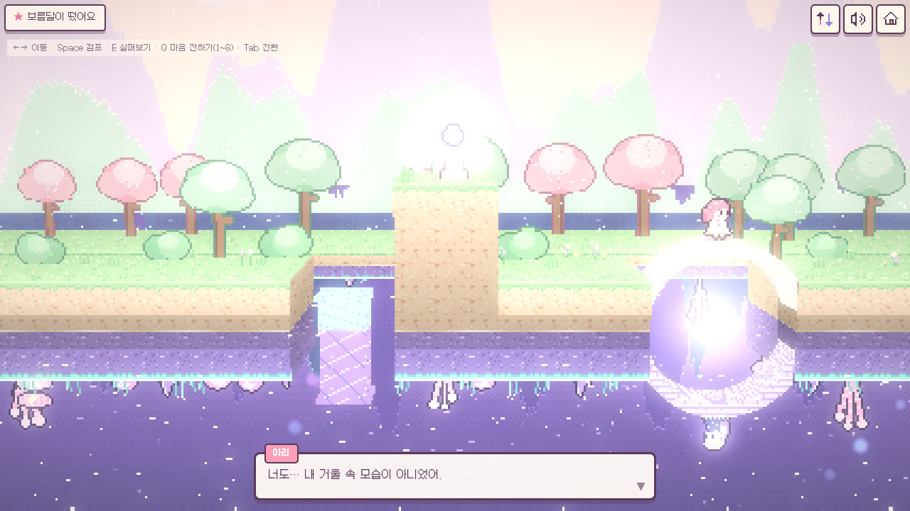

# 윤슬 — 물 위의 나, 물 아래의 너 (프로토타입 v0.1)

수면을 사이에 둔 두 소녀의 **2인 전용 협동 힐링 퍼즐 어드벤처**예요.
three.js로 만든 2.5D 도트 게임이고, PWA로 설치할 수 있어요. 별도 게임 서버 없이 WebRTC P2P로 둘이 연결돼요.

**▶ 바로 플레이: [starterpack-master.github.io/yunseul](https://starterpack-master.github.io/yunseul/)**
휴대폰으로 열어서 **친구와 함께 · 방 만들기**를 누르고, 나오는 초대 링크를 친구에게 보내면 돼요. 브라우저 메뉴의 "홈 화면에 추가"를 누르면 앱처럼 설치돼요.

- 기획서: [docs/GDD.md](docs/GDD.md)
- 이번 프로토타입 범위: 1장 「윤슬」 전체 (시작부터 엔딩까지 플레이 가능)

| 물 위 · 리아 시점 | 물 아래 · 아리 시점 |
|---|---|
|  |  |
| **부표 시소**: 리아가 누르면 아리가 올라가요 | **보름달 엔딩**: 반달 다리와 반영이 합쳐져요 |
|  |  |

## 실행

```bash
npm install
npm run dev       # 개발 서버
npm run build     # 타입 검사 + 배포용 빌드 (dist/)
npm run preview   # 빌드 결과 미리보기
npm run deploy    # 빌드해서 GitHub Pages(gh-pages 브랜치)에 올리기
npm run icons     # 앱 아이콘 다시 만들기 (public/icons)
```

## 플레이 방법

| 모드 | 방법 |
|---|---|
| 혼자 둘러보기 | 두 캐릭터를 번갈아 조작해요 (Tab 또는 오른쪽 위 전환 버튼). 혼자서도 1장을 끝까지 할 수 있어요. |
| 친구와 함께 | **방 만들기** → 캐릭터 선택 → 초대 링크를 보내요. 친구가 링크를 열고 **초대받은 방으로 들어가기**를 누르면 연결돼요. |
| 같은 기기 2탭 테스트 | 주소 끝에 `?net=local`을 붙이고, 한 탭에서 방을 만들고 다른 탭에서 참가해요. |

| 동작 | 키보드 | 터치 |
|---|---|---|
| 이동 | ← → / A D | 왼쪽 조이스틱 |
| 점프 | Space / W / ↑ | 큰 화살표 버튼 |
| 살펴보기·줍기·켜기 | E | 반짝이는 버튼 (할 수 있는 동작이 표시돼요) |
| 마음 전하기 (이모트 8종) | Q, 또는 숫자 1~8 | 말풍선 버튼 |
| 시점 전환 (혼자 모드) | Tab | 오른쪽 위 전환 버튼 |

물에 빠져도 "퐁" 하고 물가로 돌아와요. 시간 제한이나 게임오버는 없어요.

## 배포

[GitHub Pages](https://starterpack-master.github.io/yunseul/)로 서비스해요. Pages는 `gh-pages` 브랜치(빌드 결과물)를 그대로 보여 줘요.

- `main`에 커밋이 들어오면 [`.github/workflows/deploy.yml`](.github/workflows/deploy.yml)이 빌드해서 `gh-pages`에 올려요. 1~2분 뒤 사이트에 반영돼요.
- PR을 열면 같은 워크플로가 빌드만 해서 깨진 곳이 없는지 확인해요.
- 내 컴퓨터에서 바로 배포하려면 `npm run deploy`를 실행해요 ([`scripts/deploy-gh-pages.sh`](scripts/deploy-gh-pages.sh), 워크플로도 같은 스크립트를 써요).
- 다른 정적 호스팅(Netlify, Cloudflare Pages 등)에 올릴 때는 `npm run build`로 만든 `dist/`를 그대로 올리면 돼요. 상대 경로로 빌드해서 하위 경로에서도 동작해요.
- 휴대폰에서 PWA 설치와 WebRTC를 쓰려면 HTTPS가 필요해요. GitHub Pages는 기본으로 HTTPS예요.
- 일부 모바일 네트워크는 직접 연결을 막아요. 이런 경우를 위해 TURN 서버를 넣을 수 있어요.
  - GitHub 배포: 저장소 **Settings → Secrets and variables → Actions → Variables**에 `VITE_TURN_URLS`, `VITE_TURN_USERNAME`, `VITE_TURN_CREDENTIAL`을 추가하면 다음 배포부터 적용돼요.
  - 직접 빌드: `VITE_TURN_URLS=turn:turn.example.com:3478 VITE_TURN_USERNAME=user VITE_TURN_CREDENTIAL=pass npm run build`
  - 이 값들은 게임 코드에 들어가서 누구나 볼 수 있어요. 사용량 제한이 있는 계정을 쓰세요.

## 구조

```
src/
  game/    규칙과 로직: 레벨(level), 공유 상태와 호스트 시뮬레이션(world), 물리(physics),
           플레이어, 입력, 스토리·목표(story), 전체 흐름(game)
  render/  도트 그래픽 생성(pixelart), 두 세계 장면(stage), 수면 합성 파이프라인(renderer, shaders), 파티클
  net/     전송 계층(transport: WebRTC P2P / BroadcastChannel), 방·동기화 프로토콜(session)
  audio/   음원 파일 없이 연주하는 BGM 2레이어와 효과음
  ui/      화면 UI (목표, 대화, 이모트, 버튼)
pwa/sw-template.js   서비스 워커 템플릿 (빌드할 때 사전 캐시 목록이 채워져요)
scripts/             앱 아이콘 생성, gh-pages 배포 스크립트
.github/workflows/   main에 합치면 자동 배포, PR은 빌드 확인
docs/                기획서와 스크린샷
```

- **그래픽**: 모든 도트(캐릭터, 지형, 소품, 배경, 아이콘)를 코드로 직접 찍어요. 외부 이미지 파일이 없어요.
- **수면**: 두 세계를 각각 렌더링한 뒤, 광선과 수면(y=0)의 교차를 계산해서 상대 세계를 일렁이고 흐리게 비춰요. 아래 세계 플레이어의 화면은 마지막 단계에서 상하만 뒤집어요. 그래서 두 사람 모두 "내가 위, 네가 물속"으로 보고, 왼쪽/오른쪽은 똑같이 통해요.
- **온라인**: 방 코드로 공용 Nostr 릴레이에서 서로를 찾고, 게임 데이터는 WebRTC로 직접 주고받아요. 방을 만든 쪽(호스트)이 공유 상태를 계산해요. 연결이 끊겨도 같은 링크로 다시 들어오면 이어서 할 수 있어요. 호스트가 새로고침하면 브라우저에 저장된 상태로 이어가요.

## 프로토타입의 한계

- 1장만 있어요. 거울 집, 정원, 방치(종이배·편지병), NPC는 기획서에만 설계되어 있어요.
- TURN 서버가 기본으로 없어서 일부 네트워크 조합에서는 연결이 안 될 수 있어요. 또 공용 릴레이에 의존하므로 정식 서비스에서는 자체 시그널링을 권장해요.
- 실제 휴대폰(iOS Safari, 안드로이드 Chrome)에서는 아직 시험하지 않았어요. 헤드리스 Chrome(소프트웨어 렌더링)에서 약 40fps가 나왔어요.

## 폰트 라이선스

Galmuri © Lee Minseo, SIL Open Font License 1.1 — [public/fonts/Galmuri-OFL.txt](public/fonts/Galmuri-OFL.txt)
