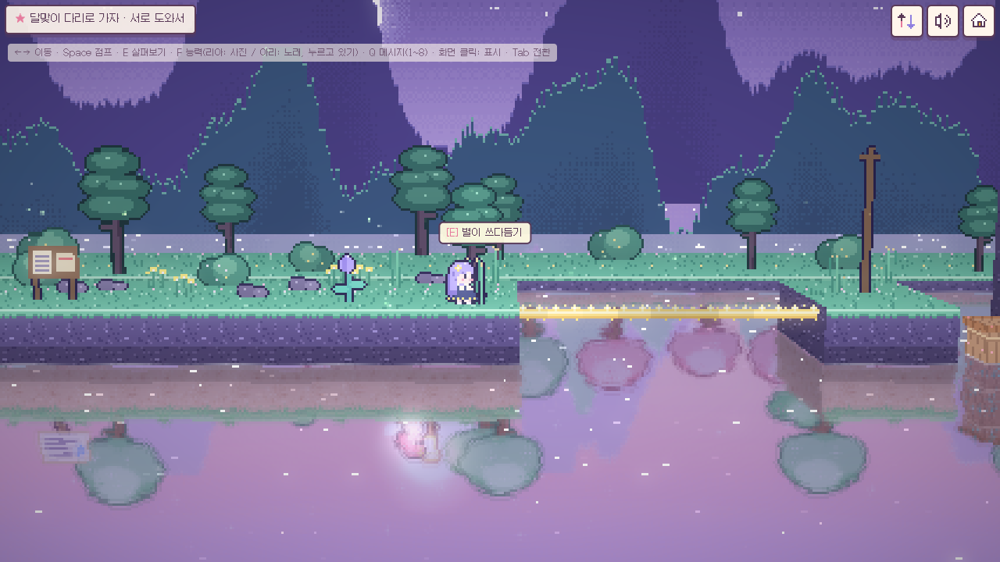
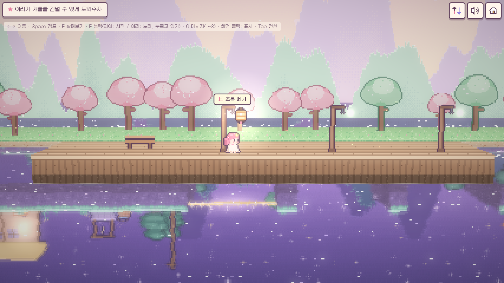
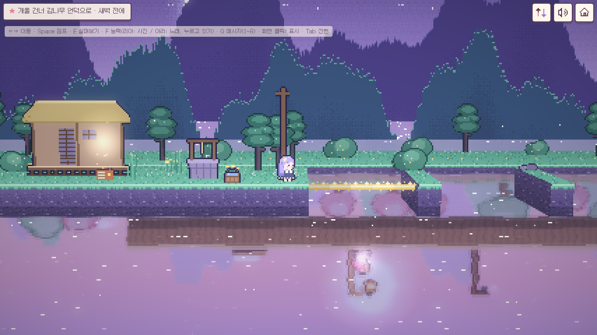
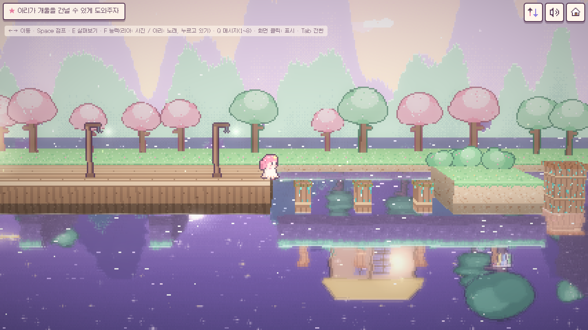
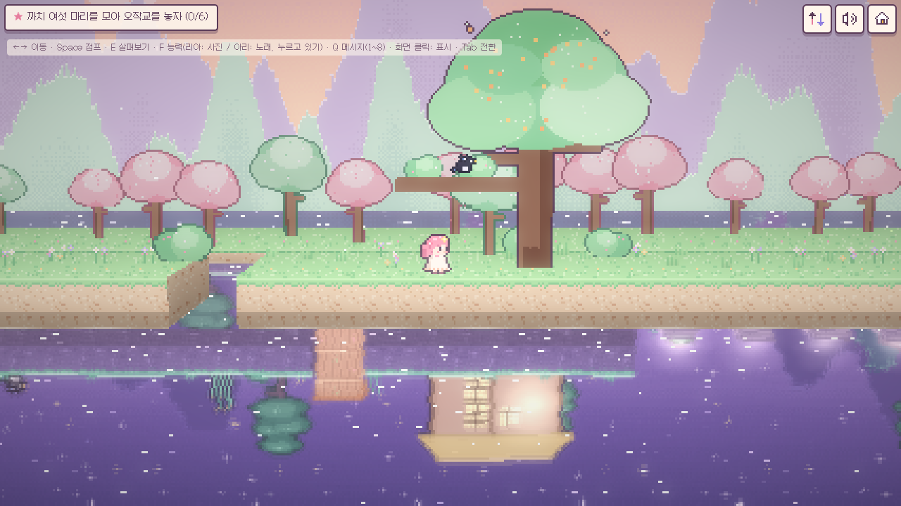
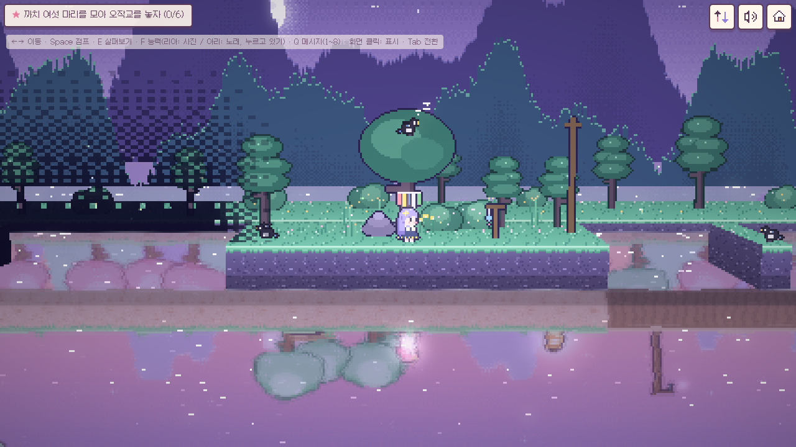

# 다음 여름에 만나 (프로토타입 v0.3)

물속의 아이와 보낸 사흘 밤. 호수를 사이에 둔 두 소녀의 **2인 전용 협동 퍼즐 어드벤처**예요.
three.js로 만든 2.5D 도트 게임이고, PWA로 설치할 수 있어요. 별도 게임 서버 없이 WebRTC P2P로 둘이 연결돼요.

**▶ 바로 플레이: [starterpack-master.github.io/yunseul](https://starterpack-master.github.io/yunseul/)**
휴대폰으로 열어서 **친구와 함께 · 방 만들기**를 누르고, 나오는 초대 링크를 친구에게 보내면 돼요. 브라우저 메뉴의 "홈 화면에 추가"를 누르면 앱처럼 설치돼요.

- 기획서 (이야기의 반전 포함): [docs/GDD.md](docs/GDD.md)
- 이번 범위: 프롤로그 → 1장 물속의 아이 → 2장 다시, 같은 밤 → 3장 칠석 → 에필로그, 그리고 두 번째 여름(2회차)

| 로비 | 프롤로그 · 말하는 사람에게 다가가는 카메라 |
|---|---|
|  |  |
| **1장** 리아가 켠 등불이 아리 쪽에서 별빛 다리가 돼요 | **2장** 초롱은 하나, 초롱걸이는 셋 |
|  |  |
| **2장** 초롱 아래 개울에만 빛길이 생겨요 (아리 시점) | **2장** 1973년에 박은 말뚝이 지금의 그루터기로 |
|  |  |
| **3장** 높은 둥지의 까치 | **3장** 노래로는 안 깨는 까치 |
|  |  |

## 이야기

여름방학, **리아**는 호숫가 할머니 댁에 와요. 할머니는 별 머리핀을 꽂아 주며 "물에 비친 애가 너랑 다르게 움직이거든. 인사해 주렴" 하세요. 해 질 녘 호수에 비친 소녀 **아리**가 정말로 말을 걸어와요.
리아는 사흘 저녁 동안 호수에 가요. 아리가 사는 **달못 마을**은 호수 아래 어딘가에 있어요.

<details><summary>스포일러: 반전</summary>

- 1장 끝: 달못 마을은 댐 때문에 물에 잠긴 마을이에요. 아리는 1973년, 수문이 닫히기 전날 밤에 있어요.
- 2장: 다음 날 가 보니 아리가 "…누구야?" 아리에게는 **같은 칠석 밤이 되풀이**되고 있어요. 새벽 전에 마을을 벗어나려는데, 아리가 "미안해, 리아" 하고 멈춰요. 그날은 이름을 말한 적이 없는데요.
- 3장: 아리는 전부 기억하고 있었어요. 마을을 잃기 싫어 "아침이 오지 않게" 빌었고, 백 번 넘게 혼자 그 밤을 살았어요. 둘은 까치 다리 위에서 처음으로 진짜 만나고, 아리는 아침을 받아들여요. "다음 여름에 만나."
- 에필로그: 할머니가 아리예요. 리아라는 이름도 할머니가 "아리를 거꾸로" 지어 준 거예요. 제목은 50년 걸린 약속이에요.
</details>

## 퍼즐

두 세계의 규칙 다섯 가지를 섞어서 풀어요.

1. 한쪽에서 켠 빛은 반대편 물 위에서 길이 돼요.
2. 말뚝은 두 세계에 하나예요. 한쪽이 밟으면 반대편 끝이 솟아요.
3. 물에 빠뜨린 작은 물건(구슬, 동전)은 반대편 세계로 건너가요.
4. 1973년에 한 일은 지금에 남아요 (박은 말뚝 → 그루터기, 물 준 어린 감나무 → 섬까지 닿는 가지).
5. 서로에게만 보이는 게 있어요 (캄캄한 늪의 징검돌은 리아의 물그림자에서만 보여요).

| 장 | 내용 |
|---|---|
| 1장 물속의 아이 | 튜토리얼. 규칙을 하나씩 익히며 달맞이 다리 꼭대기로 |
| 2장 다시, 같은 밤 | 초롱 하나를 세 걸이에 옮겨 걸며 아리를 개울 건너편으로. 아리는 물건을 하나만 들 수 있어서 물동이와 말뚝의 순서를 생각해야 해요. 울타리 말뚝, 언덕 말뚝, 감나무가 서로 얽혀 있어요 |
| 3장 칠석 | 까치 여섯 마리, 부르는 방법이 다 달라요 (동전 보내기, 말뚝 발판, 늪 안내, 사진 플래시로 깨우기, 초롱 옮기기, 바위 올려 주기). 순서는 자유예요 |

- 목표 창에는 해답이 아니라 목표만 나와요. 한동안 막혀 있으면 그 자리에 맞는 도움말이 캐릭터의 말로 한 줄씩 나와요.
- 대화는 짧게 주고받고, 말하는 사람 쪽으로 화면이 뒤집히며 넘어가요 (리아는 물 위, 아리는 물 아래). 중요한 순간에는 카메라가 얼굴 가까이 가고 음악이 멎어요.

## 플레이 방법

| 모드 | 방법 |
|---|---|
| 친구와 함께 | **방 만들기** → 캐릭터 선택 → 초대 링크를 보내요. 친구가 링크를 열고 **초대받은 방으로 들어가기**를 누르면 연결돼요. 각자 자기 집 이야기를 본 뒤, 둘 다 물가에 서면 함께 보는 장면이 시작돼요. |
| 혼자 하기 | 두 캐릭터를 번갈아 조작해요 (Tab 또는 오른쪽 위 전환 버튼). 아리가 노래하다 전환해도 노래가 10초 이어져요. |
| 같은 기기 2탭 테스트 | 주소 끝에 `?net=local`을 붙이고, 한 탭에서 방을 만들고 다른 탭에서 참가해요. |

| 동작 | 키보드 | 터치 |
|---|---|---|
| 이동 | ← → / A D | 왼쪽 조이스틱 |
| 점프 | Space / W / ↑ | 큰 화살표 버튼 |
| 살펴보기·줍기·걸기·켜기·대화 | E / Enter | 동작 버튼 (할 수 있는 동작이 표시돼요) |
| 능력: 리아 **사진** / 아리 **노래** | F (아리는 누르고 있기) | 가까이 할 게 없을 때 동작 버튼 |
| 퀵 메시지 8종 | Q, 또는 숫자 1~8 | 말풍선 버튼 |
| 핑 (여기 봐!) | 화면 클릭 | 화면 탭 |
| 시점 전환 (혼자 하기) | Tab | 오른쪽 위 전환 버튼 |

물에 빠져도 "퐁" 하고 가까운 물가로 돌아와요. 물에 빠진 물건은 물가로 떠밀려 오거나 처음 자리로 돌아와요. 시간 제한이나 게임오버는 없어요.

## 두 번째 여름 · 수집 · 꾸미기

- **두 번째 여름 (2회차)**: 아리와 할머니의 속마음이 보여요. 호숫가에 **할머니의 일기장** 5쪽이 나타나고, 다 모으면 진엔딩이 열려요.
- **추억 앨범**: 장마다 숨은 추억 3개와 리아의 사진, 일기장이 모여요.
- **옷장**: 옷 5벌, 머리색 4가지, 소품 4가지. 입은 모습이 친구 화면에도 보여요.
- 진행, 추억, 옷장은 기기(localStorage)에 저장돼요. 계정은 없어요.

<details><summary>스포일러: 숨은 요소</summary>

- 20초 가만히 있으면 꾸벅꾸벅 졸아요.
- 한 장에서 물에 10번 빠지면 붕어가 인사해요.
- 방 코드 칸에 `ARIRIA`를 넣으면 고양이 귀가 열려요.
- 1973년 하늘의 달을 세 번 누르면 달토끼가 보여요.
- 로비 제목을 다섯 번 누르면 물그림자가 잠깐 흔들려요.
- 할머니 댁 라디오와 1973년 옆집 라디오에서 같은 노래가 나와요.
</details>

## 연결이 끊겼을 때

잠깐 오프라인이 됐다가 돌아와도 자동으로 다시 이어져요. 1초 하트비트로 끊김을 알아채고, 네트워크·화면 복귀 때 릴레이 소켓과 WebRTC 연결을 새로 열어 방에 다시 들어가요 ([`src/net/transport.ts`](src/net/transport.ts)). 25초 넘게 안 이어지면 **새로고침해서 다시 연결** 버튼이 나오고, 누르면 같은 방으로 자동으로 다시 들어가요.

## 실행

```bash
npm install
npm run dev       # 개발 서버
npm run build     # 타입 검사 + 배포용 빌드 (dist/)
npm run preview   # 빌드 결과 미리보기
npm run deploy    # 빌드해서 GitHub Pages(gh-pages 브랜치)에 올리기
npm run icons     # 앱 아이콘 다시 만들기 (public/icons)
```

## 배포

[GitHub Pages](https://starterpack-master.github.io/yunseul/)로 서비스해요. Pages는 `gh-pages` 브랜치(빌드 결과물)를 그대로 보여 줘요.

- `main`에 커밋이 들어오면 [`.github/workflows/deploy.yml`](.github/workflows/deploy.yml)이 빌드해서 `gh-pages`에 올려요. PR을 열면 빌드만 해서 깨진 곳이 없는지 확인해요.
- 내 컴퓨터에서 바로 배포하려면 `npm run deploy`를 실행해요 ([`scripts/deploy-gh-pages.sh`](scripts/deploy-gh-pages.sh)).
- 다른 정적 호스팅에 올릴 때는 `npm run build`로 만든 `dist/`를 그대로 올리면 돼요. 상대 경로로 빌드해서 하위 경로에서도 동작해요.
- 일부 모바일 네트워크는 직접 연결을 막아요. 이런 경우를 위해 TURN 서버를 넣을 수 있어요.
  - GitHub 배포: 저장소 **Settings → Secrets and variables → Actions → Variables**에 `VITE_TURN_URLS`, `VITE_TURN_USERNAME`, `VITE_TURN_CREDENTIAL`을 추가하면 다음 배포부터 적용돼요.
  - 직접 빌드: `VITE_TURN_URLS=turn:turn.example.com:3478 VITE_TURN_USERNAME=user VITE_TURN_CREDENTIAL=pass npm run build`
  - 이 값들은 게임 코드에 들어가서 누구나 볼 수 있어요. 사용량 제한이 있는 계정을 쓰세요.

## 구조

```
src/
  game/
    chapters/  장 데이터: 지형, 장치(등불·말뚝·초롱걸이·그루터기·까치…), 목표, 대사 트리거, 도움말, 함께 보는 장면
    world.ts   공유 상태와 호스트 시뮬레이션 (행동 적용, 노래·플래시, 목표, 장 넘기기, 물에 뜬 물건)
    scenes.ts  모든 대본 (대사 + 카메라 연출 단계)        director.ts  대본 재생기
    game.ts    전체 흐름 (입력, 네트워크, 컷신 카메라, 능력, 핑, 도움말, 이스터에그)
    physics.ts · player.ts · input.ts · save.ts (진행·옷장·앨범 저장)
  render/  도트 생성(pixelart, sprites, characters, icons), 두 세계 장면(stage),
           수면 합성 파이프라인과 카메라(renderer, shaders), 파티클
  net/     전송 계층(transport: WebRTC P2P + 재접속 / BroadcastChannel), 방·동기화 프로토콜(session)
  audio/   음원 파일 없이 연주하는 BGM, 허밍, 환경음, 효과음
  ui/      화면 UI (목표, 대화, 자막, 안내, 메시지, 핑, 카드)
pwa/sw-template.js   서비스 워커 템플릿 (빌드할 때 사전 캐시 목록이 채워져요)
scripts/             앱 아이콘 생성, gh-pages 배포 스크립트
docs/                기획서와 스크린샷
```

- **그래픽**: 모든 도트를 코드로 직접 찍어요. 외부 이미지 파일이 없어요.
- **수면**: 두 세계를 각각 렌더링한 뒤, 광선과 수면(y=0)의 교차를 계산해서 상대 세계를 일렁이게 비춰요. 물 위에 보여야 하는 발판(빛길, 반딧불)은 깊이를 쓰는 불투명 도트로 그려서 물에 덮이지 않아요.
- **온라인**: 방 코드로 공용 Nostr 릴레이에서 서로를 찾고, 게임 데이터는 WebRTC로 직접 주고받아요. 방을 만든 쪽(호스트)이 공유 상태를 계산하고, 장 전환과 함께 보는 장면도 호스트가 열어요.

## 프로토타입의 한계

- TURN 서버가 기본으로 없어서 일부 네트워크 조합(서로 다른 통신사의 모바일 데이터 등)에서는 연결이 안 될 수 있어요.
- 실제 휴대폰(iOS Safari, 안드로이드 Chrome)에서는 아직 시험하지 않았어요. 헤드리스 Chrome으로 휴대폰 화면과 터치 조작만 확인했어요.
- 소리는 코드로 합성해요. 자동 테스트에서는 재생 오류만 확인했어요.

## 폰트 라이선스

Galmuri © Lee Minseo, SIL Open Font License 1.1 — [public/fonts/Galmuri-OFL.txt](public/fonts/Galmuri-OFL.txt)
